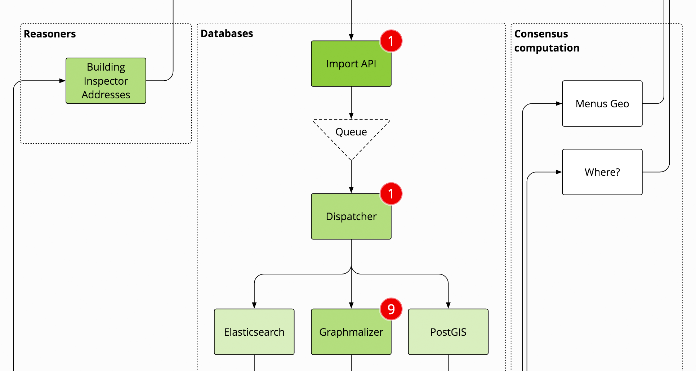
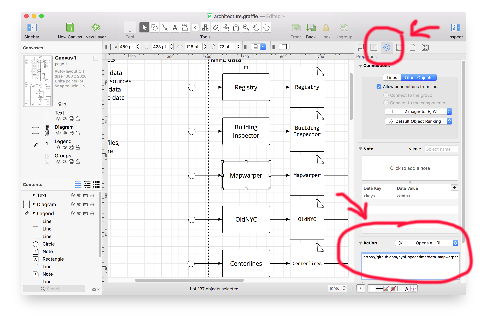

# Space/Time Directory Architecture Diagram

See http://spacetime.nypl.org/architecture/.



## Create your own architecture diagram!

It's easy! Download and install [Omnigraffle](https://www.omnigroup.com/omnigraffle), create your architecture diagram and add links to each component's GitHub repository:

1. Go to the properties pane of an object;
2. Add an _Opens an URL_ action;
3. add GitHub repository HTTPS URL



Or, if you don't want to use Omnigraffle, that's fine too! Just make sure architecture components
are contained by an `<a>` element with an `xl:href` attribute, like so:

```html
<a xl:href="https://github.com/nypl-spacetime/data-1854-directory">
  <path d="M 451 774 L 448 777 C 448 775.34315 449.34315 774 451 774 Z" />
  <text>
    <tspan>Queue</tspan>
  </text>
</a>
```

You can set the finished state of your components in [`data.json`](data.json) (0 is not started, 1 is finished):

```json
{
  "https://github.com/nypl-spacetime/histograph-core": 0.5,
  "https://github.com/nypl-spacetime/histograph-io": 0.8,
  "https://github.com/graphmalizer/graphmalizer-core": 0.5,
  "https://github.com/nypl-spacetime/histograph-data": 0.8
}
```

And finally, replace __my__ GitHub authorization in [`js/github-auth.js`](js/github-auth.js) token with yours!

# License

MIT
